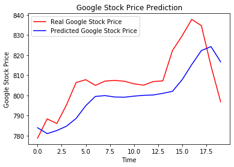
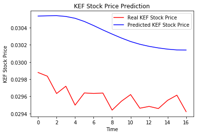
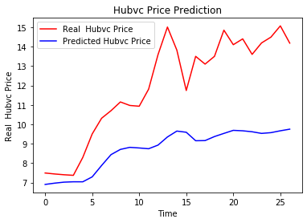
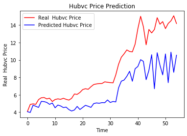

```python
import numpy as np
import matplotlib.pyplot as plt
import pandas as pd
```

**LSTM FOR GOOGLE STOCK PRICE**


```python
dataset_train=pd.read_csv('/Users/infoletsbecoolcom/Downloads/Recurrent_Neural_Networks 2/Google_Stock_Price_Train.csv')
```


```python
dataset_train
```


<div>
<style scoped>
    .dataframe tbody tr th:only-of-type {
        vertical-align: middle;
    }

    .dataframe tbody tr th {
        vertical-align: top;
    }

    .dataframe thead th {
        text-align: right;
    }
</style>
<table border="1" class="dataframe">
  <thead>
    <tr style="text-align: right;">
      <th></th>
      <th>Date</th>
      <th>Open</th>
      <th>High</th>
      <th>Low</th>
      <th>Close</th>
      <th>Volume</th>
    </tr>
  </thead>
  <tbody>
    <tr>
      <th>0</th>
      <td>1/3/2012</td>
      <td>325.25</td>
      <td>332.83</td>
      <td>324.97</td>
      <td>663.59</td>
      <td>7,380,500</td>
    </tr>
    <tr>
      <th>1</th>
      <td>1/4/2012</td>
      <td>331.27</td>
      <td>333.87</td>
      <td>329.08</td>
      <td>666.45</td>
      <td>5,749,400</td>
    </tr>
    <tr>
      <th>2</th>
      <td>1/5/2012</td>
      <td>329.83</td>
      <td>330.75</td>
      <td>326.89</td>
      <td>657.21</td>
      <td>6,590,300</td>
    </tr>
    <tr>
      <th>3</th>
      <td>1/6/2012</td>
      <td>328.34</td>
      <td>328.77</td>
      <td>323.68</td>
      <td>648.24</td>
      <td>5,405,900</td>
    </tr>
    <tr>
      <th>4</th>
      <td>1/9/2012</td>
      <td>322.04</td>
      <td>322.29</td>
      <td>309.46</td>
      <td>620.76</td>
      <td>11,688,800</td>
    </tr>
    <tr>
      <th>...</th>
      <td>...</td>
      <td>...</td>
      <td>...</td>
      <td>...</td>
      <td>...</td>
      <td>...</td>
    </tr>
    <tr>
      <th>1253</th>
      <td>12/23/2016</td>
      <td>790.90</td>
      <td>792.74</td>
      <td>787.28</td>
      <td>789.91</td>
      <td>623,400</td>
    </tr>
    <tr>
      <th>1254</th>
      <td>12/27/2016</td>
      <td>790.68</td>
      <td>797.86</td>
      <td>787.66</td>
      <td>791.55</td>
      <td>789,100</td>
    </tr>
    <tr>
      <th>1255</th>
      <td>12/28/2016</td>
      <td>793.70</td>
      <td>794.23</td>
      <td>783.20</td>
      <td>785.05</td>
      <td>1,153,800</td>
    </tr>
    <tr>
      <th>1256</th>
      <td>12/29/2016</td>
      <td>783.33</td>
      <td>785.93</td>
      <td>778.92</td>
      <td>782.79</td>
      <td>744,300</td>
    </tr>
    <tr>
      <th>1257</th>
      <td>12/30/2016</td>
      <td>782.75</td>
      <td>782.78</td>
      <td>770.41</td>
      <td>771.82</td>
      <td>1,770,000</td>
    </tr>
  </tbody>
</table>
<p>1258 rows × 6 columns</p>
</div>


```python
training_set=dataset_train.iloc[:,1:2].values
```


```python
from sklearn.preprocessing import MinMaxScaler
sc=MinMaxScaler(feature_range=(0,1))
training_Set_scaled=sc.fit_transform(training_set)
```


```python
#creating a data structure with 60 timesteps and 1 output
X_train=[]
y_train=[]
for i in range(60,1258):
    X_train.append(training_Set_scaled[i-60:i,0])
    y_train.append(training_Set_scaled[i,0])
X_train,y_train=np.array(X_train),np.array(y_train)    
    
```


```python
X_train.shape[1]
```


    60


```python
#reshaping
X_train=np.reshape(X_train,(X_train.shape[0],X_train.shape[1],1))
```


```python
from keras.models import Sequential
from keras.layers import Dense
from keras.layers import LSTM
from keras.layers import Dropout
```

    Using TensorFlow backend.


```python
#initialising the RNN
regressor=Sequential()

```


```python
regressor.add(LSTM(units=50,return_sequences=True,input_shape=(X_train.shape[1],1)))
regressor.add(Dropout(0.2))
```


```python
regressor.add(LSTM(units=50,return_sequences=True))
regressor.add(Dropout(0.2))
```


```python
regressor.add(LSTM(units=50,return_sequences=True))
regressor.add(Dropout(0.2))
```


```python
regressor.add(LSTM(units=50))
regressor.add(Dropout(0.2))
```


```python
regressor.add(Dense(units=1))
```


```python
regressor.compile(optimizer='adam',loss='mean_squared_error')
```


```python
regressor.fit(X_train,y_train,epochs=100,batch_size=32)
```

    Epoch 1/100
    1198/1198 [==============================] - 10s 8ms/step - loss: 0.0395
    Epoch 2/100
    1198/1198 [==============================] - 6s 5ms/step - loss: 0.0070
    Epoch 3/100
    1198/1198 [==============================] - 7s 6ms/step - loss: 0.0051
    Epoch 4/100
    1198/1198 [==============================] - 6s 5ms/step - loss: 0.0054
    Epoch 5/100
    1198/1198 [==============================] - 7s 6ms/step - loss: 0.0047
    Epoch 6/100
    1198/1198 [==============================] - 7s 6ms/step - loss: 0.0045
    Epoch 7/100
    1198/1198 [==============================] - 8s 7ms/step - loss: 0.0057
    Epoch 8/100
    1198/1198 [==============================] - 7s 6ms/step - loss: 0.0042
    Epoch 9/100
    1198/1198 [==============================] - 7s 6ms/step - loss: 0.0042
    Epoch 10/100
    1198/1198 [==============================] - 7s 6ms/step - loss: 0.0042
    Epoch 11/100
    1198/1198 [==============================] - 8s 6ms/step - loss: 0.0045
    Epoch 12/100
    1198/1198 [==============================] - 8s 7ms/step - loss: 0.0035
    Epoch 13/100
    1198/1198 [==============================] - 10s 8ms/step - loss: 0.0043
    Epoch 14/100
    1198/1198 [==============================] - 7s 6ms/step - loss: 0.0036
    Epoch 15/100
    1198/1198 [==============================] - 7s 6ms/step - loss: 0.0035
    Epoch 16/100
    1198/1198 [==============================] - 8s 7ms/step - loss: 0.0036
    Epoch 17/100
    1198/1198 [==============================] - 9s 7ms/step - loss: 0.0035
    Epoch 18/100
    1198/1198 [==============================] - 6s 5ms/step - loss: 0.0037
    Epoch 19/100
    1198/1198 [==============================] - 6s 5ms/step - loss: 0.0031
    Epoch 20/100
    1198/1198 [==============================] - 6s 5ms/step - loss: 0.0038
    Epoch 21/100
    1198/1198 [==============================] - 6s 5ms/step - loss: 0.0037
    Epoch 22/100
    1198/1198 [==============================] - 6s 5ms/step - loss: 0.0031
    Epoch 23/100
    1198/1198 [==============================] - 7s 6ms/step - loss: 0.0034
    Epoch 24/100
    1198/1198 [==============================] - 6s 5ms/step - loss: 0.0033
    Epoch 25/100
    1198/1198 [==============================] - 6s 5ms/step - loss: 0.0032
    Epoch 26/100
    1198/1198 [==============================] - 6s 5ms/step - loss: 0.0030
    Epoch 27/100
    1198/1198 [==============================] - 6s 5ms/step - loss: 0.0030
    Epoch 28/100
    1198/1198 [==============================] - 5s 5ms/step - loss: 0.0033
    Epoch 29/100
    1198/1198 [==============================] - 6s 5ms/step - loss: 0.0028
    Epoch 30/100
    1198/1198 [==============================] - 5s 5ms/step - loss: 0.0027
    Epoch 31/100
    1198/1198 [==============================] - 5s 5ms/step - loss: 0.0029
    Epoch 32/100
    1198/1198 [==============================] - 5s 5ms/step - loss: 0.0026
    Epoch 33/100
    1198/1198 [==============================] - 6s 5ms/step - loss: 0.0028
    Epoch 34/100
    1198/1198 [==============================] - 6s 5ms/step - loss: 0.0029
    Epoch 35/100
    1198/1198 [==============================] - 5s 5ms/step - loss: 0.0027
    Epoch 36/100
    1198/1198 [==============================] - 6s 5ms/step - loss: 0.0026
    Epoch 37/100
    1198/1198 [==============================] - 5s 5ms/step - loss: 0.0024
    Epoch 38/100
    1198/1198 [==============================] - 6s 5ms/step - loss: 0.0024
    Epoch 39/100
    1198/1198 [==============================] - 5s 5ms/step - loss: 0.0025
    Epoch 40/100
    1198/1198 [==============================] - 6s 5ms/step - loss: 0.0024
    Epoch 41/100
    1198/1198 [==============================] - 6s 5ms/step - loss: 0.0025
    Epoch 42/100
    1198/1198 [==============================] - 6s 5ms/step - loss: 0.0022
    Epoch 43/100
    1198/1198 [==============================] - 6s 5ms/step - loss: 0.0024
    Epoch 44/100
    1198/1198 [==============================] - 6s 5ms/step - loss: 0.0025
    Epoch 45/100
    1198/1198 [==============================] - 6s 5ms/step - loss: 0.0024
    Epoch 46/100
    1198/1198 [==============================] - 6s 5ms/step - loss: 0.0023
    Epoch 47/100
    1198/1198 [==============================] - 5s 5ms/step - loss: 0.0023
    Epoch 48/100
    1198/1198 [==============================] - 5s 5ms/step - loss: 0.0021
    Epoch 49/100
    1198/1198 [==============================] - 6s 5ms/step - loss: 0.0026
    Epoch 50/100
    1198/1198 [==============================] - 5s 5ms/step - loss: 0.0022
    Epoch 51/100
    1198/1198 [==============================] - 5s 4ms/step - loss: 0.0020
    Epoch 52/100
    1198/1198 [==============================] - 5s 5ms/step - loss: 0.0021
    Epoch 53/100
    1198/1198 [==============================] - 5s 5ms/step - loss: 0.0022
    Epoch 54/100
    1198/1198 [==============================] - 5s 5ms/step - loss: 0.0021
    Epoch 55/100
    1198/1198 [==============================] - 5s 5ms/step - loss: 0.0021
    Epoch 56/100
    1198/1198 [==============================] - 5s 5ms/step - loss: 0.0025
    Epoch 57/100
    1198/1198 [==============================] - 5s 5ms/step - loss: 0.0024
    Epoch 58/100
    1198/1198 [==============================] - 5s 5ms/step - loss: 0.0022
    Epoch 59/100
    1198/1198 [==============================] - 6s 5ms/step - loss: 0.0022
    Epoch 60/100
    1198/1198 [==============================] - 5s 4ms/step - loss: 0.0020
    Epoch 61/100
    1198/1198 [==============================] - 5s 5ms/step - loss: 0.0024
    Epoch 62/100
    1198/1198 [==============================] - 5s 5ms/step - loss: 0.0021
    Epoch 63/100
    1198/1198 [==============================] - 6s 5ms/step - loss: 0.0019
    Epoch 64/100
    1198/1198 [==============================] - 6s 5ms/step - loss: 0.0018
    Epoch 65/100
    1198/1198 [==============================] - 6s 5ms/step - loss: 0.0019
    Epoch 66/100
    1198/1198 [==============================] - 5s 5ms/step - loss: 0.0018
    Epoch 67/100
    1198/1198 [==============================] - 5s 5ms/step - loss: 0.0017
    Epoch 68/100
    1198/1198 [==============================] - 5s 5ms/step - loss: 0.0018
    Epoch 69/100
    1198/1198 [==============================] - 6s 5ms/step - loss: 0.0018
    Epoch 70/100
    1198/1198 [==============================] - 5s 5ms/step - loss: 0.0017
    Epoch 71/100
    1198/1198 [==============================] - 5s 4ms/step - loss: 0.0020
    Epoch 72/100
    1198/1198 [==============================] - 5s 5ms/step - loss: 0.0021
    Epoch 73/100
    1198/1198 [==============================] - 5s 5ms/step - loss: 0.0016
    Epoch 74/100
    1198/1198 [==============================] - 6s 5ms/step - loss: 0.0017
    Epoch 75/100
    1198/1198 [==============================] - 5s 5ms/step - loss: 0.0017
    Epoch 76/100
    1198/1198 [==============================] - 5s 4ms/step - loss: 0.0016
    Epoch 77/100
    1198/1198 [==============================] - 5s 4ms/step - loss: 0.0019
    Epoch 78/100
    1198/1198 [==============================] - 6s 5ms/step - loss: 0.0016
    Epoch 79/100
    1198/1198 [==============================] - 5s 5ms/step - loss: 0.0016
    Epoch 80/100
    1198/1198 [==============================] - 6s 5ms/step - loss: 0.0015
    Epoch 81/100
    1198/1198 [==============================] - 6s 5ms/step - loss: 0.0016
    Epoch 82/100
    1198/1198 [==============================] - 8s 6ms/step - loss: 0.0018
    Epoch 83/100
    1198/1198 [==============================] - 5s 5ms/step - loss: 0.0015
    Epoch 84/100
    1198/1198 [==============================] - 9s 8ms/step - loss: 0.0017
    Epoch 85/100
    1198/1198 [==============================] - 7s 6ms/step - loss: 0.0014
    Epoch 86/100
    1198/1198 [==============================] - 7s 6ms/step - loss: 0.0017
    Epoch 87/100
    1198/1198 [==============================] - 6s 5ms/step - loss: 0.0017
    Epoch 88/100
    1198/1198 [==============================] - 6s 5ms/step - loss: 0.0016
    Epoch 89/100
    1198/1198 [==============================] - 8s 6ms/step - loss: 0.0016
    Epoch 90/100
    1198/1198 [==============================] - 7s 6ms/step - loss: 0.0013
    Epoch 91/100
    1198/1198 [==============================] - 7s 6ms/step - loss: 0.0015A: 1s - lo
    Epoch 92/100
    1198/1198 [==============================] - 6s 5ms/step - loss: 0.0015
    Epoch 93/100
    1198/1198 [==============================] - 6s 5ms/step - loss: 0.0014
    Epoch 94/100
    1198/1198 [==============================] - 6s 5ms/step - loss: 0.0013
    Epoch 95/100
    1198/1198 [==============================] - 6s 5ms/step - loss: 0.0014
    Epoch 96/100
    1198/1198 [==============================] - 6s 5ms/step - loss: 0.0016
    Epoch 97/100
    1198/1198 [==============================] - 6s 5ms/step - loss: 0.0014
    Epoch 98/100
    1198/1198 [==============================] - 6s 5ms/step - loss: 0.0013
    Epoch 99/100
    1198/1198 [==============================] - 7s 6ms/step - loss: 0.0012
    Epoch 100/100
    1198/1198 [==============================] - 8s 7ms/step - loss: 0.0014


    <keras.callbacks.callbacks.History at 0x1a37372890>


```python
dataset_test=pd.read_csv('/Users/infoletsbecoolcom/Downloads/Recurrent_Neural_Networks 2/Google_Stock_Price_Test.csv')
```


```python
real_stock_price=dataset_test.iloc[:,1:2].values
```


```python
#getting the predicted stock price of 2017
dataset_total=pd.concat((dataset_train['Open'],dataset_test['Open']),axis=0)
inputs=dataset_total[len(dataset_total)-len(dataset_test)-60:].values
```


```python
inputs=inputs.reshape(-1,1)
```


```python
inputs=sc.transform(inputs)
```


```python
X_test=[]
for i in range(60,80):
    X_test.append(inputs[i-60:i,0])
X_test=np.array(X_test)
```


```python
X_test=np.reshape(X_test,(X_test.shape[0],X_test.shape[1],1))
```


```python
X_test.shape
```


    (20, 60, 1)


```python
predicted_stock_price=regressor.predict(X_test)
predicted_stock_price=sc.inverse_transform(predicted_stock_price)
```


```python
predicted_stock_price
```


    array([[783.9656 ],
           [781.04724],
           [782.5784 ],
           [784.7232 ],
           [788.5731 ],
           [794.90015],
           [799.5288 ],
           [799.9274 ],
           [799.2424 ],
           [799.1403 ],
           [799.66016],
           [800.072  ],
           [800.2403 ],
           [801.0485 ],
           [802.0534 ],
           [807.7852 ],
           [815.33685],
           [822.29974],
           [824.2769 ],
           [816.7002 ]], dtype=float32)


```python
plt.plot(real_stock_price,color='red',label='Real Google Stock Price')
plt.plot(predicted_stock_price,color='blue',label='Predicted Google Stock Price')
plt.title('Google Stock Price Prediction')
plt.xlabel('Time')
plt.ylabel('Google Stock Price')
plt.legend()
plt.show()
```





```python
import math
from sklearn.metrics import mean_squared_error
rmse=math.sqrt(mean_squared_error(real_stock_price,predicted_stock_price))
rmse
```


    12.409779498270817


**KATILIM EMEKLİLİK FONU LSTM TAHMİNİ**


```python
kef=pd.read_csv('/Users/infoletsbecoolcom/Downloads/data/KEF-Table 1.csv',delimiter=';')
```


```python
kef
```


<div>
<style scoped>
    .dataframe tbody tr th:only-of-type {
        vertical-align: middle;
    }

    .dataframe tbody tr th {
        vertical-align: top;
    }

    .dataframe thead th {
        text-align: right;
    }
</style>
<table border="1" class="dataframe">
  <thead>
    <tr style="text-align: right;">
      <th></th>
      <th>Date</th>
      <th>KEF</th>
    </tr>
  </thead>
  <tbody>
    <tr>
      <th>0</th>
      <td>16/07/2014</td>
      <td>0,010417</td>
    </tr>
    <tr>
      <th>1</th>
      <td>22/07/2014</td>
      <td>0,010433</td>
    </tr>
    <tr>
      <th>2</th>
      <td>23/07/2014</td>
      <td>0,010420</td>
    </tr>
    <tr>
      <th>3</th>
      <td>24/07/2014</td>
      <td>0,010274</td>
    </tr>
    <tr>
      <th>4</th>
      <td>31/07/2014</td>
      <td>0,010180</td>
    </tr>
    <tr>
      <th>...</th>
      <td>...</td>
      <td>...</td>
    </tr>
    <tr>
      <th>1316</th>
      <td>31/10/2019</td>
      <td>0,029848</td>
    </tr>
    <tr>
      <th>1317</th>
      <td>01/11/2019</td>
      <td>0,030058</td>
    </tr>
    <tr>
      <th>1318</th>
      <td>04/11/2019</td>
      <td>0,030255</td>
    </tr>
    <tr>
      <th>1319</th>
      <td>05/11/2019</td>
      <td>0,029940</td>
    </tr>
    <tr>
      <th>1320</th>
      <td>06/11/2019</td>
      <td>0,030020</td>
    </tr>
  </tbody>
</table>
<p>1321 rows × 2 columns</p>
</div>


```python
kef["KEF"] = kef["KEF"].apply(lambda x: x.replace(',','.'))

kef["KEF"] = kef["KEF"].apply(float)
```


```python
training_set=kef.iloc[:,1:2].values
```


```python
training_set
```


    array([[0.010417],
           [0.010433],
           [0.01042 ],
           ...,
           [0.030255],
           [0.02994 ],
           [0.03002 ]])


```python
from sklearn.preprocessing import MinMaxScaler
sc=MinMaxScaler(feature_range=(0,1))
training_Set_scaled=sc.fit_transform(training_set)
```


```python
#creating a data structure with 120 timesteps(6 months) and 1 output
X_train=[]
y_train=[]
for i in range(120,1321):
    X_train.append(training_Set_scaled[i-120:i,0])
    y_train.append(training_Set_scaled[i,0])
X_train,y_train=np.array(X_train),np.array(y_train)
```


```python
#reshaping
X_train=np.reshape(X_train,(X_train.shape[0],X_train.shape[1],1))
```


```python
from keras.models import Sequential
from keras.layers import Dense
from keras.layers import LSTM
from keras.layers import Dropout
```


```python
#initialising the RNN
regressor=Sequential()

```


```python
regressor.add(LSTM(units=50,return_sequences=True,input_shape=(X_train.shape[1],1)))
regressor.add(Dropout(0.2))
```


```python
regressor.add(LSTM(units=50,return_sequences=True))
regressor.add(Dropout(0.2))
```


```python
regressor.add(LSTM(units=50,return_sequences=True))
regressor.add(Dropout(0.2))
```


```python
regressor.add(LSTM(units=50))
regressor.add(Dropout(0.2))
```


```python
regressor.add(Dense(units=1))
```


```python
regressor.compile(optimizer='adam',loss='mean_squared_error')
```


```python
regressor.fit(X_train,y_train,epochs=100,batch_size=32)
```

    Epoch 1/100
    1201/1201 [==============================] - 16s 13ms/step - loss: 0.0496
    Epoch 2/100
    1201/1201 [==============================] - 13s 11ms/step - loss: 0.0048
    Epoch 3/100
    1201/1201 [==============================] - 12s 10ms/step - loss: 0.0041
    Epoch 4/100
    1201/1201 [==============================] - 11s 9ms/step - loss: 0.0040
    Epoch 5/100
    1201/1201 [==============================] - 11s 9ms/step - loss: 0.0035
    Epoch 6/100
    1201/1201 [==============================] - 11s 9ms/step - loss: 0.0036
    Epoch 7/100
    1201/1201 [==============================] - 11s 9ms/step - loss: 0.0040
    Epoch 8/100
    1201/1201 [==============================] - 11s 9ms/step - loss: 0.0032
    Epoch 9/100
    1201/1201 [==============================] - 11s 9ms/step - loss: 0.0029
    Epoch 10/100
    1201/1201 [==============================] - 11s 9ms/step - loss: 0.0035
    Epoch 11/100
    1201/1201 [==============================] - 11s 9ms/step - loss: 0.0035
    Epoch 12/100
    1201/1201 [==============================] - 11s 9ms/step - loss: 0.0034
    Epoch 13/100
    1201/1201 [==============================] - 11s 9ms/step - loss: 0.0030
    Epoch 14/100
    1201/1201 [==============================] - 11s 9ms/step - loss: 0.0026
    Epoch 15/100
    1201/1201 [==============================] - 11s 9ms/step - loss: 0.0029
    Epoch 16/100
    1201/1201 [==============================] - 11s 9ms/step - loss: 0.0032
    Epoch 17/100
    1201/1201 [==============================] - 11s 9ms/step - loss: 0.0027
    Epoch 18/100
    1201/1201 [==============================] - 11s 9ms/step - loss: 0.0031
    Epoch 19/100
    1201/1201 [==============================] - 11s 9ms/step - loss: 0.0029
    Epoch 20/100
    1201/1201 [==============================] - 11s 9ms/step - loss: 0.0029
    Epoch 21/100
    1201/1201 [==============================] - 11s 9ms/step - loss: 0.0022
    Epoch 22/100
    1201/1201 [==============================] - 11s 9ms/step - loss: 0.0023
    Epoch 23/100
    1201/1201 [==============================] - 14s 11ms/step - loss: 0.0028
    Epoch 24/100
    1201/1201 [==============================] - 11s 10ms/step - loss: 0.0024
    Epoch 25/100
    1201/1201 [==============================] - 11s 9ms/step - loss: 0.0025
    Epoch 26/100
    1201/1201 [==============================] - 11s 9ms/step - loss: 0.0022
    Epoch 27/100
    1201/1201 [==============================] - 11s 9ms/step - loss: 0.0023
    Epoch 28/100
    1201/1201 [==============================] - 11s 9ms/step - loss: 0.0026
    Epoch 29/100
    1201/1201 [==============================] - 11s 9ms/step - loss: 0.0023
    Epoch 30/100
    1201/1201 [==============================] - 11s 9ms/step - loss: 0.0019
    Epoch 31/100
    1201/1201 [==============================] - 11s 9ms/step - loss: 0.0023
    Epoch 32/100
    1201/1201 [==============================] - 11s 9ms/step - loss: 0.0018
    Epoch 33/100
    1201/1201 [==============================] - 11s 9ms/step - loss: 0.0023
    Epoch 34/100
    1201/1201 [==============================] - 11s 9ms/step - loss: 0.0023
    Epoch 35/100
    1201/1201 [==============================] - 13s 11ms/step - loss: 0.0020
    Epoch 36/100
    1201/1201 [==============================] - 11s 10ms/step - loss: 0.0022
    Epoch 37/100
    1201/1201 [==============================] - 12s 10ms/step - loss: 0.0021
    Epoch 38/100
    1201/1201 [==============================] - 13s 10ms/step - loss: 0.0020
    Epoch 39/100
    1201/1201 [==============================] - 12s 10ms/step - loss: 0.0022
    Epoch 40/100
    1201/1201 [==============================] - 11s 10ms/step - loss: 0.0020
    Epoch 41/100
    1201/1201 [==============================] - 11s 10ms/step - loss: 0.0020
    Epoch 42/100
    1201/1201 [==============================] - 11s 9ms/step - loss: 0.0020
    Epoch 43/100
    1201/1201 [==============================] - 12s 10ms/step - loss: 0.0022
    Epoch 44/100
    1201/1201 [==============================] - 12s 10ms/step - loss: 0.0018
    Epoch 45/100
    1201/1201 [==============================] - 11s 9ms/step - loss: 0.0017
    Epoch 46/100
    1201/1201 [==============================] - 11s 10ms/step - loss: 0.0020
    Epoch 47/100
    1201/1201 [==============================] - 11s 9ms/step - loss: 0.0017
    Epoch 48/100
    1201/1201 [==============================] - 11s 9ms/step - loss: 0.0017
    Epoch 49/100
    1201/1201 [==============================] - 11s 9ms/step - loss: 0.0017
    Epoch 50/100
    1201/1201 [==============================] - 12s 10ms/step - loss: 0.0019
    Epoch 51/100
    1201/1201 [==============================] - 11s 9ms/step - loss: 0.0018
    Epoch 52/100
    1201/1201 [==============================] - 11s 9ms/step - loss: 0.0015
    Epoch 53/100
    1201/1201 [==============================] - 11s 9ms/step - loss: 0.0017
    Epoch 54/100
    1201/1201 [==============================] - 11s 9ms/step - loss: 0.0016
    Epoch 55/100
    1201/1201 [==============================] - 11s 9ms/step - loss: 0.0015
    Epoch 56/100
    1201/1201 [==============================] - 11s 9ms/step - loss: 0.0015
    Epoch 57/100
    1201/1201 [==============================] - 11s 9ms/step - loss: 0.0016
    Epoch 58/100
    1201/1201 [==============================] - 11s 9ms/step - loss: 0.0014
    Epoch 59/100
    1201/1201 [==============================] - 11s 9ms/step - loss: 0.0016
    Epoch 60/100
    1201/1201 [==============================] - 11s 9ms/step - loss: 0.0015
    Epoch 61/100
    1201/1201 [==============================] - 13s 11ms/step - loss: 0.0013
    Epoch 62/100
    1201/1201 [==============================] - 12s 10ms/step - loss: 0.0014
    Epoch 63/100
    1201/1201 [==============================] - 11s 9ms/step - loss: 0.0012
    Epoch 64/100
    1201/1201 [==============================] - 11s 9ms/step - loss: 0.0015
    Epoch 65/100
    1201/1201 [==============================] - 11s 9ms/step - loss: 0.0015
    Epoch 66/100
    1201/1201 [==============================] - 11s 9ms/step - loss: 0.0013
    Epoch 67/100
    1201/1201 [==============================] - 11s 9ms/step - loss: 0.0012
    Epoch 68/100
    1201/1201 [==============================] - 11s 9ms/step - loss: 0.0013
    Epoch 69/100
    1201/1201 [==============================] - 11s 9ms/step - loss: 0.0012
    Epoch 70/100
    1201/1201 [==============================] - 11s 9ms/step - loss: 0.0012
    Epoch 71/100
    1201/1201 [==============================] - 11s 9ms/step - loss: 0.0013
    Epoch 72/100
    1201/1201 [==============================] - 11s 9ms/step - loss: 0.0013
    Epoch 73/100
    1201/1201 [==============================] - 11s 9ms/step - loss: 0.0012
    Epoch 74/100
    1201/1201 [==============================] - 11s 9ms/step - loss: 0.0011
    Epoch 75/100
    1201/1201 [==============================] - 11s 9ms/step - loss: 0.0011
    Epoch 76/100
    1201/1201 [==============================] - 11s 9ms/step - loss: 0.0012
    Epoch 77/100
    1201/1201 [==============================] - 11s 9ms/step - loss: 0.0012
    Epoch 78/100
    1201/1201 [==============================] - 11s 9ms/step - loss: 0.0012
    Epoch 79/100
    1201/1201 [==============================] - 11s 9ms/step - loss: 0.0013
    Epoch 80/100
    1201/1201 [==============================] - 11s 9ms/step - loss: 0.0011
    Epoch 81/100
    1201/1201 [==============================] - 11s 9ms/step - loss: 0.0011
    Epoch 82/100
    1201/1201 [==============================] - 11s 9ms/step - loss: 0.0011
    Epoch 83/100
    1201/1201 [==============================] - 13s 11ms/step - loss: 0.0011
    Epoch 84/100
    1201/1201 [==============================] - 14s 12ms/step - loss: 0.0011
    Epoch 85/100
    1201/1201 [==============================] - 13s 11ms/step - loss: 9.1130e-04
    Epoch 86/100
    1201/1201 [==============================] - 11s 9ms/step - loss: 0.0012
    Epoch 87/100
    1201/1201 [==============================] - 18s 15ms/step - loss: 0.0011
    Epoch 88/100
    1201/1201 [==============================] - 13s 11ms/step - loss: 0.0011
    Epoch 89/100
    1201/1201 [==============================] - 11s 9ms/step - loss: 9.0605e-04
    Epoch 90/100
    1201/1201 [==============================] - 12s 10ms/step - loss: 9.4197e-04
    Epoch 91/100
    1201/1201 [==============================] - 16s 14ms/step - loss: 9.5071e-04
    Epoch 92/100
    1201/1201 [==============================] - 12s 10ms/step - loss: 9.1262e-04
    Epoch 93/100
    1201/1201 [==============================] - 13s 11ms/step - loss: 8.9030e-04
    Epoch 94/100
    1201/1201 [==============================] - 12s 10ms/step - loss: 9.1508e-04
    Epoch 95/100
    1201/1201 [==============================] - 11s 10ms/step - loss: 9.9730e-04
    Epoch 96/100
    1201/1201 [==============================] - 14s 12ms/step - loss: 9.1644e-04
    Epoch 97/100
    1201/1201 [==============================] - 12s 10ms/step - loss: 9.5303e-04
    Epoch 98/100
    1201/1201 [==============================] - 11s 9ms/step - loss: 8.8270e-04
    Epoch 99/100
    1201/1201 [==============================] - 12s 10ms/step - loss: 8.4872e-04
    Epoch 100/100
    1201/1201 [==============================] - 12s 10ms/step - loss: 8.8553e-04


    <keras.callbacks.callbacks.History at 0x1a3c18e950>


```python
dataset_test=pd.read_excel('/Users/infoletsbecoolcom/Downloads/kef_test.xlsx')
```


```python
dataset_test
```


<div>
<style scoped>
    .dataframe tbody tr th:only-of-type {
        vertical-align: middle;
    }

    .dataframe tbody tr th {
        vertical-align: top;
    }

    .dataframe thead th {
        text-align: right;
    }
</style>
<table border="1" class="dataframe">
  <thead>
    <tr style="text-align: right;">
      <th></th>
      <th>TARİH</th>
      <th>FON KODU</th>
      <th>FON ADI</th>
      <th>FİYAT</th>
      <th>TEDAVÜLDEKİ PAY SAYISI</th>
      <th>KİŞİ SAYISI</th>
      <th>FON TOPLAM DEĞER</th>
    </tr>
  </thead>
  <tbody>
    <tr>
      <th>0</th>
      <td>2019-11-07</td>
      <td>KEF</td>
      <td>KATILIM EMEKLİLİK VE HAYAT A.Ş. ALTIN KATILIM ...</td>
      <td>0.029878</td>
      <td>13026000000</td>
      <td>147199</td>
      <td>389190734</td>
    </tr>
    <tr>
      <th>1</th>
      <td>2019-11-08</td>
      <td>KEF</td>
      <td>KATILIM EMEKLİLİK VE HAYAT A.Ş. ALTIN KATILIM ...</td>
      <td>0.029835</td>
      <td>13048000000</td>
      <td>147469</td>
      <td>389281445</td>
    </tr>
    <tr>
      <th>2</th>
      <td>2019-11-11</td>
      <td>KEF</td>
      <td>KATILIM EMEKLİLİK VE HAYAT A.Ş. ALTIN KATILIM ...</td>
      <td>0.029633</td>
      <td>13072000000</td>
      <td>147780</td>
      <td>387359912</td>
    </tr>
    <tr>
      <th>3</th>
      <td>2019-11-12</td>
      <td>KEF</td>
      <td>KATILIM EMEKLİLİK VE HAYAT A.Ş. ALTIN KATILIM ...</td>
      <td>0.029718</td>
      <td>13085000000</td>
      <td>148180</td>
      <td>388851640</td>
    </tr>
    <tr>
      <th>4</th>
      <td>2019-11-13</td>
      <td>KEF</td>
      <td>KATILIM EMEKLİLİK VE HAYAT A.Ş. ALTIN KATILIM ...</td>
      <td>0.029498</td>
      <td>13101000000</td>
      <td>148454</td>
      <td>386461106</td>
    </tr>
    <tr>
      <th>5</th>
      <td>2019-11-14</td>
      <td>KEF</td>
      <td>KATILIM EMEKLİLİK VE HAYAT A.Ş. ALTIN KATILIM ...</td>
      <td>0.029640</td>
      <td>13128000000</td>
      <td>148874</td>
      <td>389104999</td>
    </tr>
    <tr>
      <th>6</th>
      <td>2019-11-15</td>
      <td>KEF</td>
      <td>KATILIM EMEKLİLİK VE HAYAT A.Ş. ALTIN KATILIM ...</td>
      <td>0.029634</td>
      <td>13147000000</td>
      <td>149044</td>
      <td>389616630</td>
    </tr>
    <tr>
      <th>7</th>
      <td>2019-11-18</td>
      <td>KEF</td>
      <td>KATILIM EMEKLİLİK VE HAYAT A.Ş. ALTIN KATILIM ...</td>
      <td>0.029639</td>
      <td>13165000000</td>
      <td>149325</td>
      <td>390196532</td>
    </tr>
    <tr>
      <th>8</th>
      <td>2019-11-19</td>
      <td>KEF</td>
      <td>KATILIM EMEKLİLİK VE HAYAT A.Ş. ALTIN KATILIM ...</td>
      <td>0.029440</td>
      <td>13184000000</td>
      <td>149713</td>
      <td>388130433</td>
    </tr>
    <tr>
      <th>9</th>
      <td>2019-11-20</td>
      <td>KEF</td>
      <td>KATILIM EMEKLİLİK VE HAYAT A.Ş. ALTIN KATILIM ...</td>
      <td>0.029543</td>
      <td>13237000000</td>
      <td>150201</td>
      <td>391050717</td>
    </tr>
    <tr>
      <th>10</th>
      <td>2019-11-21</td>
      <td>KEF</td>
      <td>KATILIM EMEKLİLİK VE HAYAT A.Ş. ALTIN KATILIM ...</td>
      <td>0.029621</td>
      <td>13249000000</td>
      <td>150612</td>
      <td>392442321</td>
    </tr>
    <tr>
      <th>11</th>
      <td>2019-11-22</td>
      <td>KEF</td>
      <td>KATILIM EMEKLİLİK VE HAYAT A.Ş. ALTIN KATILIM ...</td>
      <td>0.029462</td>
      <td>13259000000</td>
      <td>150910</td>
      <td>390643263</td>
    </tr>
    <tr>
      <th>12</th>
      <td>2019-11-25</td>
      <td>KEF</td>
      <td>KATILIM EMEKLİLİK VE HAYAT A.Ş. ALTIN KATILIM ...</td>
      <td>0.029483</td>
      <td>13288000000</td>
      <td>151259</td>
      <td>391758591</td>
    </tr>
    <tr>
      <th>13</th>
      <td>2019-11-26</td>
      <td>KEF</td>
      <td>KATILIM EMEKLİLİK VE HAYAT A.Ş. ALTIN KATILIM ...</td>
      <td>0.029458</td>
      <td>13301000000</td>
      <td>151554</td>
      <td>391819638</td>
    </tr>
    <tr>
      <th>14</th>
      <td>2019-11-27</td>
      <td>KEF</td>
      <td>KATILIM EMEKLİLİK VE HAYAT A.Ş. ALTIN KATILIM ...</td>
      <td>0.029554</td>
      <td>13318000000</td>
      <td>151879</td>
      <td>393583216</td>
    </tr>
    <tr>
      <th>15</th>
      <td>2019-11-28</td>
      <td>KEF</td>
      <td>KATILIM EMEKLİLİK VE HAYAT A.Ş. ALTIN KATILIM ...</td>
      <td>0.029614</td>
      <td>13333000000</td>
      <td>152234</td>
      <td>394836986</td>
    </tr>
    <tr>
      <th>16</th>
      <td>2019-11-29</td>
      <td>KEF</td>
      <td>KATILIM EMEKLİLİK VE HAYAT A.Ş. ALTIN KATILIM ...</td>
      <td>0.029422</td>
      <td>13343000000</td>
      <td>152652</td>
      <td>392583389</td>
    </tr>
  </tbody>
</table>
</div>


```python
real_stock_price=dataset_test.iloc[:,3:4].values
```


```python
#getting the predicted  price of 11.19
dataset_total=pd.concat((kef['KEF'],dataset_test['FİYAT']),axis=0)
inputs=dataset_total[len(dataset_total)-len(dataset_test)-120:].values
```


```python
inputs=inputs.reshape(-1,1)
```


```python
inputs=sc.transform(inputs)
```


```python
X_test=[]
for i in range(120,137):
    X_test.append(inputs[i-120:i,0])
X_test=np.array(X_test)
```


```python
X_test=np.reshape(X_test,(X_test.shape[0],X_test.shape[1],1))
```


```python
X_test.shape
```


    (17, 120, 1)


```python
predicted_stock_price=regressor.predict(X_test)
predicted_stock_price=sc.inverse_transform(predicted_stock_price)
```


```python
plt.plot(real_stock_price,color='red',label='Real KEF Stock Price')
plt.plot(predicted_stock_price,color='blue',label='Predicted KEF Stock Price')
plt.title('KEF Stock Price Prediction')
plt.xlabel('Time')
plt.ylabel('KEF Stock Price')
plt.legend()
plt.show()
```





```python
import math
from sklearn.metrics import mean_squared_error
rmse=math.sqrt(mean_squared_error(real_stock_price,predicted_stock_price))
rmse
```


    0.0007549502222575114


```python
predicted_stock_price
```


    array([[0.03053522],
           [0.03053844],
           [0.03053995],
           [0.03053069],
           [0.03050925],
           [0.03047231],
           [0.03042486],
           [0.03037372],
           [0.03032552],
           [0.03027972],
           [0.03023868],
           [0.03020681],
           [0.03018251],
           [0.03016418],
           [0.03014985],
           [0.03014083],
           [0.0301396 ]], dtype=float32)


**HUB GİRİŞİM SERMAYESİ YATIRIM ORTAKLIĞI FONU İÇİN LSTM**


```python
hubvc=pd.read_csv('/Users/infoletsbecoolcom/Desktop/HUBVC.IS trainnewcsv.csv',delimiter=';')
```


```python
hubvc.columns
```


    Index(['Date', 'Adj Close'], dtype='object')


```python
hubvc
```


<div>
<style scoped>
    .dataframe tbody tr th:only-of-type {
        vertical-align: middle;
    }

    .dataframe tbody tr th {
        vertical-align: top;
    }

    .dataframe thead th {
        text-align: right;
    }
</style>
<table border="1" class="dataframe">
  <thead>
    <tr style="text-align: right;">
      <th></th>
      <th>Date</th>
      <th>Adj Close</th>
    </tr>
  </thead>
  <tbody>
    <tr>
      <th>0</th>
      <td>2016-01-01</td>
      <td>1.17</td>
    </tr>
    <tr>
      <th>1</th>
      <td>2016-01-04</td>
      <td>1.16</td>
    </tr>
    <tr>
      <th>2</th>
      <td>2016-01-05</td>
      <td>1.16</td>
    </tr>
    <tr>
      <th>3</th>
      <td>2016-01-06</td>
      <td>1.16</td>
    </tr>
    <tr>
      <th>4</th>
      <td>2016-01-07</td>
      <td>1.15</td>
    </tr>
    <tr>
      <th>...</th>
      <td>...</td>
      <td>...</td>
    </tr>
    <tr>
      <th>1000</th>
      <td>2019-11-04</td>
      <td>6.93</td>
    </tr>
    <tr>
      <th>1001</th>
      <td>2019-11-05</td>
      <td>7.18</td>
    </tr>
    <tr>
      <th>1002</th>
      <td>2019-11-06</td>
      <td>7.25</td>
    </tr>
    <tr>
      <th>1003</th>
      <td>2019-11-07</td>
      <td>7.29</td>
    </tr>
    <tr>
      <th>1004</th>
      <td>2019-11-08</td>
      <td>7.30</td>
    </tr>
  </tbody>
</table>
<p>1005 rows × 2 columns</p>
</div>


```python
hubvc.info()
```

    <class 'pandas.core.frame.DataFrame'>
    RangeIndex: 1005 entries, 0 to 1004
    Data columns (total 2 columns):
    Date         1005 non-null object
    Adj Close    1005 non-null float64
    dtypes: float64(1), object(1)
    memory usage: 15.8+ KB


```python
training_set=hubvc.iloc[:,1:2].values
```


```python
training_set
```


    array([[1.17],
           [1.16],
           [1.16],
           ...,
           [7.25],
           [7.29],
           [7.3 ]])


```python
#training_set = training_set[~np.isnan(training_set)]

```


```python
#training_set
```


```python
#training_set=np.reshape(training_set,(training_set.shape[0],1))
```


```python
#training_set.shape
```


```python
from sklearn.preprocessing import MinMaxScaler
sc=MinMaxScaler(feature_range=(0,1))
training_Set_scaled=sc.fit_transform(training_set)
```


```python
#creating a data structure with 60 timesteps(3 months) and 1 output
X_train=[]
y_train=[]
for i in range(60,1005):
    X_train.append(training_Set_scaled[i-60:i,0])
    y_train.append(training_Set_scaled[i,0])
X_train,y_train=np.array(X_train),np.array(y_train)
```


```python
X_train=np.reshape(X_train,(X_train.shape[0],X_train.shape[1],1))
```


```python
X_train.shape
```


    (945, 60, 1)


```python
from keras.models import Sequential
from keras.layers import Dense
from keras.layers import LSTM
from keras.layers import Dropout
```


```python
regressor=Sequential()
```


```python
regressor.add(LSTM(units=50,return_sequences=True,input_shape=(X_train.shape[1],1)))
regressor.add(Dropout(0.2))
```


```python
regressor.add(LSTM(units=50,return_sequences=True))
regressor.add(Dropout(0.2))
```


```python
regressor.add(LSTM(units=50,return_sequences=True))
regressor.add(Dropout(0.2))
```


```python
regressor.add(LSTM(units=50))
regressor.add(Dropout(0.2))
```


```python
regressor.add(Dense(units=1))
```


```python
regressor.compile(optimizer='adam',loss='mean_squared_error')
```


```python
regressor.fit(X_train,y_train,epochs=100,batch_size=32)
```

    Epoch 1/100
    945/945 [==============================] - 7s 7ms/step - loss: 0.0060
    Epoch 2/100
    945/945 [==============================] - 5s 5ms/step - loss: 0.0021
    Epoch 3/100
    945/945 [==============================] - 4s 5ms/step - loss: 0.0021
    Epoch 4/100
    945/945 [==============================] - 5s 5ms/step - loss: 0.0021
    Epoch 5/100
    945/945 [==============================] - 5s 5ms/step - loss: 0.0019
    Epoch 6/100
    945/945 [==============================] - 4s 5ms/step - loss: 0.0018
    Epoch 7/100
    945/945 [==============================] - 4s 5ms/step - loss: 0.0016
    Epoch 8/100
    945/945 [==============================] - 4s 5ms/step - loss: 0.0018
    Epoch 9/100
    945/945 [==============================] - 4s 5ms/step - loss: 0.0015
    Epoch 10/100
    945/945 [==============================] - 4s 5ms/step - loss: 0.0015
    Epoch 11/100
    945/945 [==============================] - 5s 5ms/step - loss: 0.0011
    Epoch 12/100
    945/945 [==============================] - 5s 5ms/step - loss: 0.0016
    Epoch 13/100
    945/945 [==============================] - 4s 5ms/step - loss: 0.0017
    Epoch 14/100
    945/945 [==============================] - 4s 5ms/step - loss: 0.0013
    Epoch 15/100
    945/945 [==============================] - 4s 5ms/step - loss: 0.0013
    Epoch 16/100
    945/945 [==============================] - 5s 5ms/step - loss: 0.0012
    Epoch 17/100
    945/945 [==============================] - 6s 6ms/step - loss: 0.0012
    Epoch 18/100
    945/945 [==============================] - 6s 6ms/step - loss: 0.0014
    Epoch 19/100
    945/945 [==============================] - 7s 7ms/step - loss: 0.0017
    Epoch 20/100
    945/945 [==============================] - 7s 7ms/step - loss: 0.0011
    Epoch 21/100
    945/945 [==============================] - 5s 5ms/step - loss: 9.9414e-04
    Epoch 22/100
    945/945 [==============================] - 5s 6ms/step - loss: 9.3111e-04
    Epoch 23/100
    945/945 [==============================] - 6s 6ms/step - loss: 7.9661e-04
    Epoch 24/100
    945/945 [==============================] - 5s 5ms/step - loss: 8.6995e-04
    Epoch 25/100
    945/945 [==============================] - 5s 5ms/step - loss: 0.0016
    Epoch 26/100
    945/945 [==============================] - 6s 6ms/step - loss: 0.0010
    Epoch 27/100
    945/945 [==============================] - 5s 5ms/step - loss: 8.5494e-04
    Epoch 28/100
    945/945 [==============================] - 6s 6ms/step - loss: 8.3710e-04
    Epoch 29/100
    945/945 [==============================] - 5s 5ms/step - loss: 9.9264e-04
    Epoch 30/100
    945/945 [==============================] - 5s 5ms/step - loss: 8.6570e-04
    Epoch 31/100
    945/945 [==============================] - 5s 5ms/step - loss: 9.4681e-04
    Epoch 32/100
    945/945 [==============================] - 5s 5ms/step - loss: 8.2687e-04
    Epoch 33/100
    945/945 [==============================] - 4s 5ms/step - loss: 9.0646e-04
    Epoch 34/100
    945/945 [==============================] - 5s 5ms/step - loss: 7.5855e-04
    Epoch 35/100
    945/945 [==============================] - 5s 5ms/step - loss: 8.5760e-04
    Epoch 36/100
    945/945 [==============================] - 5s 5ms/step - loss: 7.4945e-04
    Epoch 37/100
    945/945 [==============================] - 5s 5ms/step - loss: 0.0010
    Epoch 38/100
    945/945 [==============================] - 6s 7ms/step - loss: 9.5587e-04
    Epoch 39/100
    945/945 [==============================] - 5s 6ms/step - loss: 8.3722e-04
    Epoch 40/100
    945/945 [==============================] - 6s 6ms/step - loss: 8.2023e-04
    Epoch 41/100
    945/945 [==============================] - 6s 6ms/step - loss: 6.8688e-04
    Epoch 42/100
    945/945 [==============================] - 5s 5ms/step - loss: 7.3076e-04
    Epoch 43/100
    945/945 [==============================] - 4s 5ms/step - loss: 8.8348e-04
    Epoch 44/100
    945/945 [==============================] - 4s 5ms/step - loss: 8.2386e-04
    Epoch 45/100
    945/945 [==============================] - 4s 5ms/step - loss: 7.5153e-04
    Epoch 46/100
    945/945 [==============================] - 5s 5ms/step - loss: 7.1734e-04
    Epoch 47/100
    945/945 [==============================] - 5s 5ms/step - loss: 0.0015
    Epoch 48/100
    945/945 [==============================] - 4s 5ms/step - loss: 8.2032e-04
    Epoch 49/100
    945/945 [==============================] - 4s 5ms/step - loss: 7.8287e-04
    Epoch 50/100
    945/945 [==============================] - 5s 5ms/step - loss: 8.0104e-04
    Epoch 51/100
    945/945 [==============================] - 5s 5ms/step - loss: 9.3292e-04
    Epoch 52/100
    945/945 [==============================] - 5s 5ms/step - loss: 7.5196e-04
    Epoch 53/100
    945/945 [==============================] - 5s 5ms/step - loss: 0.0011
    Epoch 54/100
    945/945 [==============================] - 5s 6ms/step - loss: 6.7787e-04
    Epoch 55/100
    945/945 [==============================] - 6s 6ms/step - loss: 8.0344e-04
    Epoch 56/100
    945/945 [==============================] - 5s 6ms/step - loss: 5.0910e-04
    Epoch 57/100
    945/945 [==============================] - 5s 5ms/step - loss: 8.2145e-04
    Epoch 58/100
    945/945 [==============================] - 4s 5ms/step - loss: 6.2687e-04
    Epoch 59/100
    945/945 [==============================] - 5s 5ms/step - loss: 6.7822e-04
    Epoch 60/100
    945/945 [==============================] - 4s 5ms/step - loss: 5.4259e-04
    Epoch 61/100
    945/945 [==============================] - 4s 5ms/step - loss: 5.2494e-04
    Epoch 62/100
    945/945 [==============================] - 4s 5ms/step - loss: 5.4748e-04
    Epoch 63/100
    945/945 [==============================] - 5s 5ms/step - loss: 6.0409e-04
    Epoch 64/100
    945/945 [==============================] - 4s 5ms/step - loss: 6.4205e-04
    Epoch 65/100
    945/945 [==============================] - 5s 5ms/step - loss: 5.5016e-04
    Epoch 66/100
    945/945 [==============================] - 5s 5ms/step - loss: 7.2787e-04
    Epoch 67/100
    945/945 [==============================] - 4s 5ms/step - loss: 5.7153e-04
    Epoch 68/100
    945/945 [==============================] - 4s 5ms/step - loss: 6.9084e-04
    Epoch 69/100
    945/945 [==============================] - 4s 5ms/step - loss: 6.2022e-04
    Epoch 70/100
    945/945 [==============================] - 4s 5ms/step - loss: 5.9299e-04
    Epoch 71/100
    945/945 [==============================] - 4s 5ms/step - loss: 6.6421e-04
    Epoch 72/100
    945/945 [==============================] - 4s 5ms/step - loss: 6.8690e-04
    Epoch 73/100
    945/945 [==============================] - 5s 5ms/step - loss: 8.5402e-04
    Epoch 74/100
    945/945 [==============================] - 5s 5ms/step - loss: 7.9200e-04
    Epoch 75/100
    945/945 [==============================] - 4s 5ms/step - loss: 6.3229e-04
    Epoch 76/100
    945/945 [==============================] - 4s 5ms/step - loss: 6.2668e-04
    Epoch 77/100
    945/945 [==============================] - 4s 5ms/step - loss: 9.4928e-04
    Epoch 78/100
    945/945 [==============================] - 4s 5ms/step - loss: 7.9417e-04
    Epoch 79/100
    945/945 [==============================] - 5s 5ms/step - loss: 6.4612e-04
    Epoch 80/100
    945/945 [==============================] - 4s 5ms/step - loss: 6.0727e-04
    Epoch 81/100
    945/945 [==============================] - 4s 5ms/step - loss: 7.8798e-04
    Epoch 82/100
    945/945 [==============================] - 4s 5ms/step - loss: 5.6122e-04
    Epoch 83/100
    945/945 [==============================] - 4s 5ms/step - loss: 6.9002e-04
    Epoch 84/100
    945/945 [==============================] - 4s 5ms/step - loss: 6.3104e-04
    Epoch 85/100
    945/945 [==============================] - 5s 5ms/step - loss: 6.3750e-04
    Epoch 86/100
    945/945 [==============================] - 4s 5ms/step - loss: 5.5655e-04
    Epoch 87/100
    945/945 [==============================] - 4s 5ms/step - loss: 6.4804e-04
    Epoch 88/100
    945/945 [==============================] - 4s 5ms/step - loss: 5.4555e-04
    Epoch 89/100
    945/945 [==============================] - 4s 5ms/step - loss: 6.0898e-04
    Epoch 90/100
    945/945 [==============================] - 5s 5ms/step - loss: 6.6672e-04
    Epoch 91/100
    945/945 [==============================] - 4s 5ms/step - loss: 4.9362e-04
    Epoch 92/100
    945/945 [==============================] - 4s 5ms/step - loss: 6.5020e-04
    Epoch 93/100
    945/945 [==============================] - 4s 5ms/step - loss: 5.3194e-04
    Epoch 94/100
    945/945 [==============================] - 4s 5ms/step - loss: 5.9320e-04
    Epoch 95/100
    945/945 [==============================] - 5s 5ms/step - loss: 4.8718e-04
    Epoch 96/100
    945/945 [==============================] - 4s 5ms/step - loss: 5.3561e-04
    Epoch 97/100
    945/945 [==============================] - 4s 5ms/step - loss: 4.7299e-04
    Epoch 98/100
    945/945 [==============================] - 4s 5ms/step - loss: 5.3332e-04
    Epoch 99/100
    945/945 [==============================] - 4s 4ms/step - loss: 5.4567e-04
    Epoch 100/100
    945/945 [==============================] - 4s 5ms/step - loss: 6.6033e-04


    <keras.callbacks.callbacks.History at 0x1a4badf7d0>


```python
dataset_test=pd.read_csv('/Users/infoletsbecoolcom/Desktop/HUBVC.IS testnewcsv.csv',delimiter=';')
```


```python
dataset_test
```


<div>
<style scoped>
    .dataframe tbody tr th:only-of-type {
        vertical-align: middle;
    }

    .dataframe tbody tr th {
        vertical-align: top;
    }

    .dataframe thead th {
        text-align: right;
    }
</style>
<table border="1" class="dataframe">
  <thead>
    <tr style="text-align: right;">
      <th></th>
      <th>Date</th>
      <th>Adj Close</th>
    </tr>
  </thead>
  <tbody>
    <tr>
      <th>0</th>
      <td>2019-11-11</td>
      <td>7.49</td>
    </tr>
    <tr>
      <th>1</th>
      <td>2019-11-12</td>
      <td>7.44</td>
    </tr>
    <tr>
      <th>2</th>
      <td>2019-11-13</td>
      <td>7.40</td>
    </tr>
    <tr>
      <th>3</th>
      <td>2019-11-14</td>
      <td>7.37</td>
    </tr>
    <tr>
      <th>4</th>
      <td>2019-11-15</td>
      <td>8.29</td>
    </tr>
    <tr>
      <th>5</th>
      <td>2019-11-18</td>
      <td>9.50</td>
    </tr>
    <tr>
      <th>6</th>
      <td>2019-11-19</td>
      <td>10.31</td>
    </tr>
    <tr>
      <th>7</th>
      <td>2019-11-20</td>
      <td>10.70</td>
    </tr>
    <tr>
      <th>8</th>
      <td>2019-11-21</td>
      <td>11.15</td>
    </tr>
    <tr>
      <th>9</th>
      <td>2019-11-22</td>
      <td>10.97</td>
    </tr>
    <tr>
      <th>10</th>
      <td>2019-11-25</td>
      <td>10.93</td>
    </tr>
    <tr>
      <th>11</th>
      <td>2019-11-26</td>
      <td>11.81</td>
    </tr>
    <tr>
      <th>12</th>
      <td>2019-11-27</td>
      <td>13.59</td>
    </tr>
    <tr>
      <th>13</th>
      <td>2019-11-28</td>
      <td>15.01</td>
    </tr>
    <tr>
      <th>14</th>
      <td>2019-11-29</td>
      <td>13.82</td>
    </tr>
    <tr>
      <th>15</th>
      <td>2019-12-02</td>
      <td>11.74</td>
    </tr>
    <tr>
      <th>16</th>
      <td>2019-12-03</td>
      <td>13.50</td>
    </tr>
    <tr>
      <th>17</th>
      <td>2019-12-04</td>
      <td>13.10</td>
    </tr>
    <tr>
      <th>18</th>
      <td>2019-12-05</td>
      <td>13.50</td>
    </tr>
    <tr>
      <th>19</th>
      <td>2019-12-06</td>
      <td>14.85</td>
    </tr>
    <tr>
      <th>20</th>
      <td>2019-12-09</td>
      <td>14.10</td>
    </tr>
    <tr>
      <th>21</th>
      <td>2019-12-10</td>
      <td>14.40</td>
    </tr>
    <tr>
      <th>22</th>
      <td>2019-12-11</td>
      <td>13.60</td>
    </tr>
    <tr>
      <th>23</th>
      <td>2019-12-12</td>
      <td>14.19</td>
    </tr>
    <tr>
      <th>24</th>
      <td>2019-12-13</td>
      <td>14.49</td>
    </tr>
    <tr>
      <th>25</th>
      <td>2019-12-16</td>
      <td>15.07</td>
    </tr>
    <tr>
      <th>26</th>
      <td>2019-12-17</td>
      <td>14.18</td>
    </tr>
  </tbody>
</table>
</div>


```python
dataset_test.columns
```


    Index(['Date', 'Adj Close'], dtype='object')


```python
real_stock_price=dataset_test.iloc[:,1:2].values
```


```python
#getting the predicted  price of 11.19
dataset_total=pd.concat((hubvc['Adj Close'],dataset_test['Adj Close']),axis=0)
inputs=dataset_total[len(dataset_total)-len(dataset_test)-60:].values
```


```python
inputs=inputs.reshape(-1,1)
```


```python
inputs=sc.transform(inputs)
```


```python
X_test=[]
for i in range(60,87):
    X_test.append(inputs[i-60:i,0])
X_test=np.array(X_test)
```


```python
X_test=np.reshape(X_test,(X_test.shape[0],X_test.shape[1],1))
```


```python
X_test.shape
```


    (27, 60, 1)


```python
predicted_stock_price=regressor.predict(X_test)
predicted_stock_price=sc.inverse_transform(predicted_stock_price)
```


```python
plt.plot(real_stock_price,color='red',label='Real  Hubvc Price')
plt.plot(predicted_stock_price,color='blue',label='Predicted Hubvc Price')
plt.title('Hubvc Price Prediction')
plt.xlabel('Time')
plt.ylabel('Real  Hubvc Price')
plt.legend()
plt.show()
```





```python
predicted_stock_price
```


    array([[6.900905 ],
           [6.96624  ],
           [7.0181684],
           [7.0372486],
           [7.0362744],
           [7.289963 ],
           [7.8761544],
           [8.435231 ],
           [8.705308 ],
           [8.811469 ],
           [8.779289 ],
           [8.739738 ],
           [8.927556 ],
           [9.346357 ],
           [9.649501 ],
           [9.589027 ],
           [9.152257 ],
           [9.159681 ],
           [9.367545 ],
           [9.529915 ],
           [9.686831 ],
           [9.664272 ],
           [9.614241 ],
           [9.530142 ],
           [9.568783 ],
           [9.664333 ],
           [9.748281 ]], dtype=float32)


```python
real_stock_price
```


    array([[ 7.49],
           [ 7.44],
           [ 7.4 ],
           [ 7.37],
           [ 8.29],
           [ 9.5 ],
           [10.31],
           [10.7 ],
           [11.15],
           [10.97],
           [10.93],
           [11.81],
           [13.59],
           [15.01],
           [13.82],
           [11.74],
           [13.5 ],
           [13.1 ],
           [13.5 ],
           [14.85],
           [14.1 ],
           [14.4 ],
           [13.6 ],
           [14.19],
           [14.49],
           [15.07],
           [14.18]])


```python
import math
from sklearn.metrics import mean_squared_error
rmse=math.sqrt(mean_squared_error(real_stock_price,predicted_stock_price))
rmse
```


    3.606848616006931


**AŞAĞISI SON 3 AYLIK TEST VERİSİ SONUCU**


```python
predicted_stock_price=regressor.predict(X_test)
predicted_stock_price=sc.inverse_transform(predicted_stock_price)
```


```python
plt.plot(real_stock_price,color='red',label='Real  Hubvc Price')
plt.plot(predicted_stock_price,color='blue',label='Predicted Hubvc Price')
plt.title('Hubvc Price Prediction')
plt.xlabel('Time')
plt.ylabel('Real  Hubvc Price')
plt.legend()
plt.show()
```





```python
predicted_stock_price
```


    array([[ 4.0618544],
           [ 3.9722483],
           [ 4.8065963],
           [ 4.687665 ],
           [ 4.5527344],
           [ 5.2430444],
           [ 5.221079 ],
           [ 5.125301 ],
           [ 4.9054213],
           [ 5.057721 ],
           [ 4.5104556],
           [ 4.826537 ],
           [ 4.7235794],
           [ 4.5374317],
           [ 4.585296 ],
           [ 4.305838 ],
           [ 4.1425824],
           [ 4.2605653],
           [ 4.667513 ],
           [ 4.313885 ],
           [ 4.5531573],
           [ 4.7955422],
           [ 4.6883216],
           [ 4.557779 ],
           [ 4.993703 ],
           [ 5.068421 ],
           [ 5.030208 ],
           [ 5.104645 ],
           [ 5.094314 ],
           [ 5.408515 ],
           [ 5.1174746],
           [ 5.23693  ],
           [ 5.182604 ],
           [ 6.796983 ],
           [ 7.5657926],
           [ 7.693386 ],
           [ 8.121231 ],
           [ 8.698707 ],
           [ 7.556985 ],
           [ 8.989552 ],
           [ 9.25442  ],
           [10.032789 ],
           [ 9.839226 ],
           [ 7.7378287],
           [ 8.8018675],
           [10.602846 ],
           [ 6.6970654],
           [10.830259 ],
           [ 9.408503 ],
           [ 8.288511 ],
           [10.692192 ],
           [ 7.393716 ],
           [10.895935 ],
           [ 8.579599 ],
           [10.548438 ]], dtype=float32)


```python
real_stock_price
```


    array([[ 4.11],
           [ 4.9 ],
           [ 4.96],
           [ 4.91],
           [ 5.45],
           [ 5.66],
           [ 5.69],
           [ 5.53],
           [ 5.61],
           [ 5.23],
           [ 5.46],
           [ 5.53],
           [ 5.48],
           [ 5.6 ],
           [ 5.48],
           [ 5.39],
           [ 5.6 ],
           [ 6.09],
           [ 6.05],
           [ 6.27],
           [ 6.6 ],
           [ 6.7 ],
           [ 6.63],
           [ 6.93],
           [ 7.18],
           [ 7.25],
           [ 7.29],
           [ 7.3 ],
           [ 7.49],
           [ 7.44],
           [ 7.4 ],
           [ 7.37],
           [ 8.29],
           [ 9.5 ],
           [10.31],
           [10.7 ],
           [11.15],
           [10.97],
           [10.93],
           [11.81],
           [13.59],
           [15.01],
           [13.82],
           [11.74],
           [13.5 ],
           [13.1 ],
           [13.5 ],
           [14.85],
           [14.1 ],
           [14.4 ],
           [13.6 ],
           [14.19],
           [14.49],
           [15.07],
           [14.18]])


```python

```
